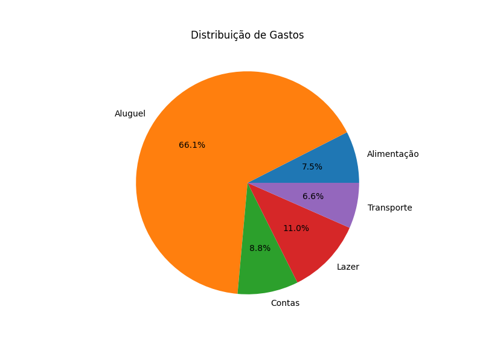
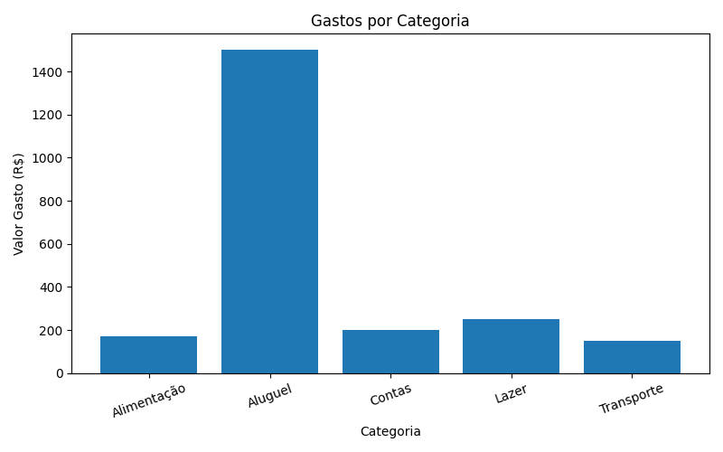
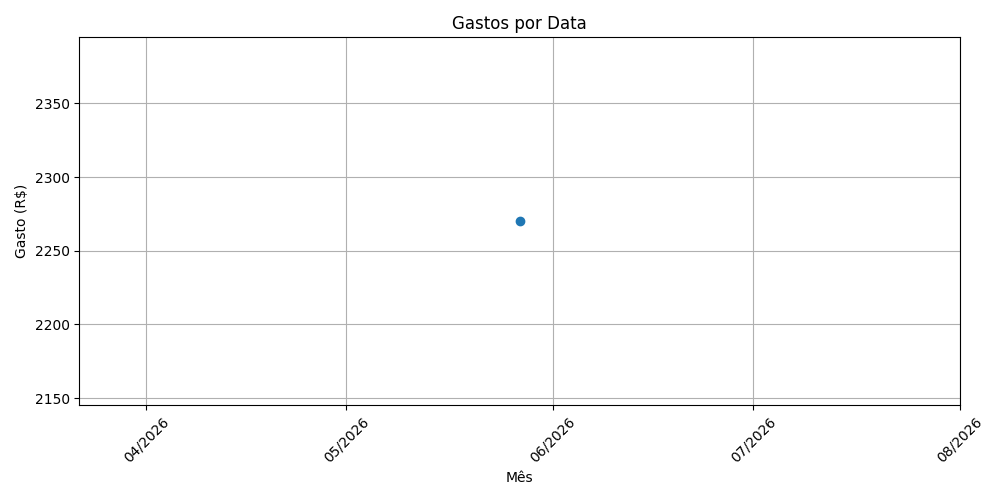
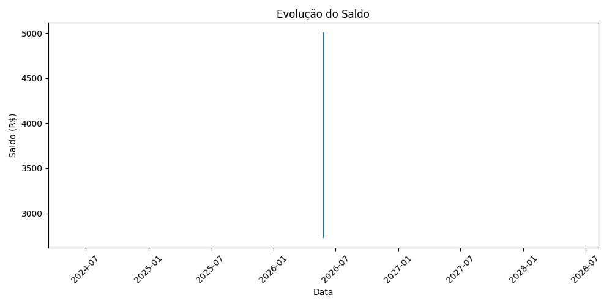

# 💰 Controle Financeiro com Python

Projeto desenvolvido em Python para controle financeiro pessoal, permitindo registrar receitas e despesas, visualizar gráficos, gerar estatísticas financeiras e exportar relatórios para Excel.

Este projeto foi criado com foco em aprendizado prático de **Python, análise de dados, visualização de dados e automação**, simulando um cenário real de organização financeira.

---

# 📌 Objetivo do Projeto

O objetivo deste projeto é permitir um controle financeiro simples e eficiente, ajudando o usuário a responder perguntas como:

### ❓ Para que serve este projeto?

- Controlar receitas e despesas pessoais
- Entender para onde o dinheiro está indo
- Identificar categorias com maiores gastos
- Analisar períodos com maior impacto financeiro
- Acompanhar evolução do saldo ao longo do tempo
- Gerar relatórios financeiros em Excel
- Visualizar dados através de gráficos

### ❓ Quais perguntas este projeto ajuda a responder?

- Em quais meses tive mais gastos?
- Quais categorias impactam mais meu orçamento?
- Estou gastando mais do que ganho?
- Como meu saldo evoluiu ao longo do tempo?
- Quanto estou gastando por categoria?
- Qual foi minha maior despesa?
- Qual foi minha maior receita?

---

# 🚀 Funcionalidades

### ✅ Registro de movimentações

Permite adicionar:

- Receitas (ex: salário, freelance, Pix recebido)
- Despesas (ex: alimentação, transporte, aluguel)

Campos registrados:

- Tipo da movimentação
- Categoria
- Valor
- Data
- Descrição

---

### ✅ Categorias padronizadas

O sistema possui categorias de despesas:

1. Alimentação  
2. Transporte  
3. Aluguel  
4. Contas  
5. Lazer  
6. Outros

---

### ✅ Validação de dados

O projeto possui validações para:

- Data inválida
- Valores negativos
- Entradas incorretas
- Opção de voltar etapas
- Opção de cancelar operação

---

### ✅ Dashboard Financeiro

Análise dos dados usando **Pandas + Matplotlib**.

Recursos disponíveis:

- Visualização de tabela
- Estatísticas financeiras
- Gráficos automáticos
- Evolução do saldo
- Exportação Excel

---

### ✅ Estatísticas Financeiras

O sistema mostra:

- Total de receitas
- Total de despesas
- Saldo atual
- Maior receita
- Maior despesa
- Quantidade de movimentações

---

### ✅ Gráficos disponíveis

### 📊 Distribuição de gastos (Pizza)

Mostra quais categorias possuem maior peso financeiro.

**Exemplo:**



---

### 📊 Gastos por Categoria (Barras)

Permite identificar onde o dinheiro está sendo gasto.

**Exemplo:**



### 📊 Gastos por Data

Ajuda a identificar períodos com maiores despesas.

**Exemplo:**



---

### 📊 Evolução do Saldo

Mostra o crescimento ou redução do saldo ao longo do tempo.

**Exemplo:**


---


### ✅ Exportação Excel

O projeto exporta automaticamente os dados financeiros para um arquivo `.xlsx`.

O arquivo contém:

### Aba 1 — Movimentações

Todas as transações registradas.

### Aba 2 — Resumo Financeiro

- Receitas
- Despesas
- Saldo

Nome automático do arquivo:

```txt
relatorio_financeiro_2026-05-27_21-30.xlsx